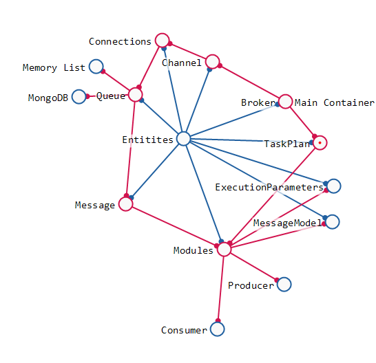

TaskMQ
======

**The version of this file is preliminary**

Introduction
-------------

Suppose you have some enterprise application consists with modules implementing BL or other features.
Usually this modules separated by web-services and communicates between each other and with main application, deliver information(e-mail, sms), deliver api level messages.

The main idea with this this project is bring control(distribution and testing) on peridic tasks and take it distal from main part of your code, with their specific ifrastructure - like performance ballancing.

Of course for all of that you can use distributed message queues or develop communication network(wcf or some web service stack with REST api or SOAP), **taskmq** tries to do it for you without thinking about deploying and configuration applications, complex distributed architecture instead of this - you can get focus on functional role of your task-specific part(or other meaning of asynchronous/delayed jobs).

The **channel** realise a functional approach, now it only means what in domain part you choose **model** (class), populate and push it to taskmq, *taskmq* picks **channel**, **queue** and eventually invoke specific module.

Other stuff
-------------
Blueprint project, message queue service with task scheduler 
Overview:  
 
Overview:  
